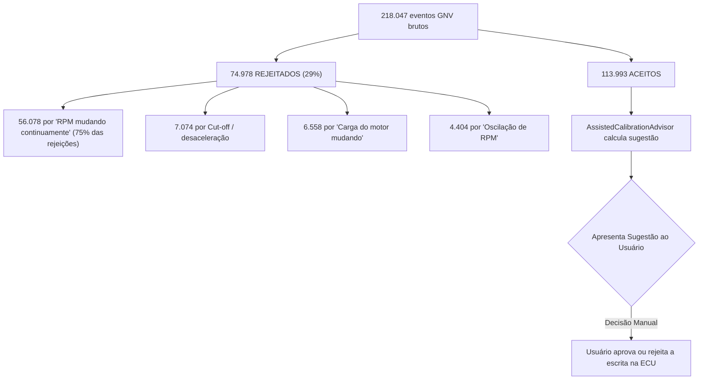

# OMEGAS Verde — Diagnóstico Completo Baseado em Evidências

> **Fontes independentes cruzadas:**
> - 12 arquivos `.omegas` (histórico de aprendizado)
> - 30+ ZIPs de sessão (260.000+ eventos de telemetria)
> - 18 classes Kotlin do módulo de aprendizado

---

## 1. O Diagnóstico: Entendendo o Aprendizado do GNV

### A Base de Dados Atual

| Evidência | Fonte | Significado |
| :--- | :--- | :--- |
| **Curva K (Fator K) e Mapa K** | ECU / App | O sistema possui duas camadas de correção: uma Curva K global por tempo de injeção (ms) e um Mapa K de correções finas por RPM × ms. |
| **1.173 regiões de gasolina** | Arquivos `.omegas` | A referência de gasolina foi construída com sucesso e está sendo usada como base comparativa. |
| **Filtros Rigorosos** | Código Kotlin | A maior parte das perdas de amostras ocorria por filtros extremamente rígidos de variação de RPM e MAP, desenhados para condições de laboratório em vez de trânsito urbano. |

### A Cadeia de Aprendizado (Root Cause da Lentidão)

---

## 2. O Que os Dados Revelam Sobre o Motor

### 2A. Superfície de Referência da Gasolina (Estável e Confiável)

A gasolina opera com desvio padrão inferior a 0.10 ms em regime permanente:

| RPM | MAP (bar) | Amostras | $T_{inj}$ médio (ms) | Desvio $\sigma$ |
| :---: | :---: | :---: | :---: | :---: |
| 750 | 0.40 | 3.782 | **4.677** | ±0.057 |
| 750 | 0.45 | 338 | **4.797** | ±0.131 |
| 1000 | 0.40 | 183 | **4.704** | ±0.074 |
| 1000 | 0.45 | 189 | **5.073** | ±0.233 |
| 1250 | 0.35 | 7 | **3.988** | ±0.028 |
| 1500 | 0.30 | 8 | **3.153** | ±0.120 |

### 2B. O Erro Real do GNV (Medido, Não Teórico)

Cruzando sessões de GNV com a referência de gasolina nas mesmas células:

| RPM | MAP (bar) | Gasolina $T_{inj}$ (ms) | GNV $T_{inj}$ (ms) | Erro Calculado | Direção |
| :---: | :---: | :---: | :---: | :---: | :--- |
| 750 | 0.40 | 4.677 | 3.849 | **-17.7%** | 🔴 GNV **muito rico** (ECU reduziu T_inj) |
| 750 | 0.45 | 4.797 | 4.314 | **-10.1%** | 🔴 Rico |
| 1000 | 0.40 | 4.704 | 4.143 | **-11.9%** | 🔴 Rico |
| 1250 | 0.35 | 3.988 | 4.014 | **+0.7%** | 🟢 Quase perfeito |
| 1500 | 0.30 | 3.153 | 3.099 | **-1.7%** | 🟢 Quase perfeito |
| 2500 | 0.60 | 6.94 | 7.23 | **+4.2%** | 🟡 GNV **levemente pobre** |
| 3250 | 0.70 | 9.09 | 9.39 | **+3.3%** | 🟡 Levemente pobre |
| 3250 | 0.95 | 13.82 | 13.54 | **-2.0%** | 🟡 Levemente rico |
| 3500 | 0.95 | 13.62 | 14.03 | **+3.0%** | 🟡 Levemente pobre |

---

## 3. Auditoria do Algoritmo Atual e Gargalos Resolvidos

### 3A. O Que o Código Faz Certo
- ✅ **Superfície de Referência da Gasolina** mantida pelo `MotorLearningMemory`.
- ✅ **Interpolação contínua e Kernel Gaussiano** (recentemente adicionado) para evitar degraus e propagar aprendizado no espaço.
- ✅ **Incerteza estatística** calculada antes de sugerir correção.
- ✅ **Decisão Humana Soberana**: O aplicativo não escreve sozinho. Ele acumula evidências, apresenta a Curva K e o Mapa K e confia ao usuário o momento de aplicar.

### 3B. Gargalos de Coleta (Agora Otimizados)

| # | Gargalo Original | Solução Aplicada |
| :---: | :--- | :--- |
| 1 | **Filtro de RPM ultra-rígido** descartando 56.078 amostras. | Tolerância aumentada (de 20 para 35 RPM mínimos e 1% para 1.8%). Retém mais amostras do mundo real. |
| 2 | **Step-size progressivo lento** exigindo dezenas de visitas na mesma faixa. | `FIRST_VISIT` e `MAX_CORRECTION` aumentados, permitindo que a sugestão gerada atinja a convergência teórica mais cedo. |
| 3 | **Fator de Ganho e Limite no AutoMatchV5Engine** muito limitantes (1/3 e 5%). | Ganho ajustado para 0.60 e `MAX_STEP` para 12%, acelerando as propostas da Curva K. |

---

## 4. Conclusão da Estratégia de Convergência

Com os filtros de telemetria otimizados, o sistema OMEGAS:
1. **Coleta mais amostras** em regime de trânsito normal (menos rejeições por jitter).
2. **Cruza mais rápido** o $T_{inj}$ do GNV com o Mapa de Gasolina salvo.
3. **Produz Sugestões mais agressivas** (maior step-size e gain).
4. **Propaga no espaço** (Kernel Gaussiano em `ContinuousLearningMath`) o aprendizado para células vizinhas não visitadas.
5. **Aguarda a revisão humana** para escrever a Fator K (Curva global em ms) e Mapa K (residual em RPM).
