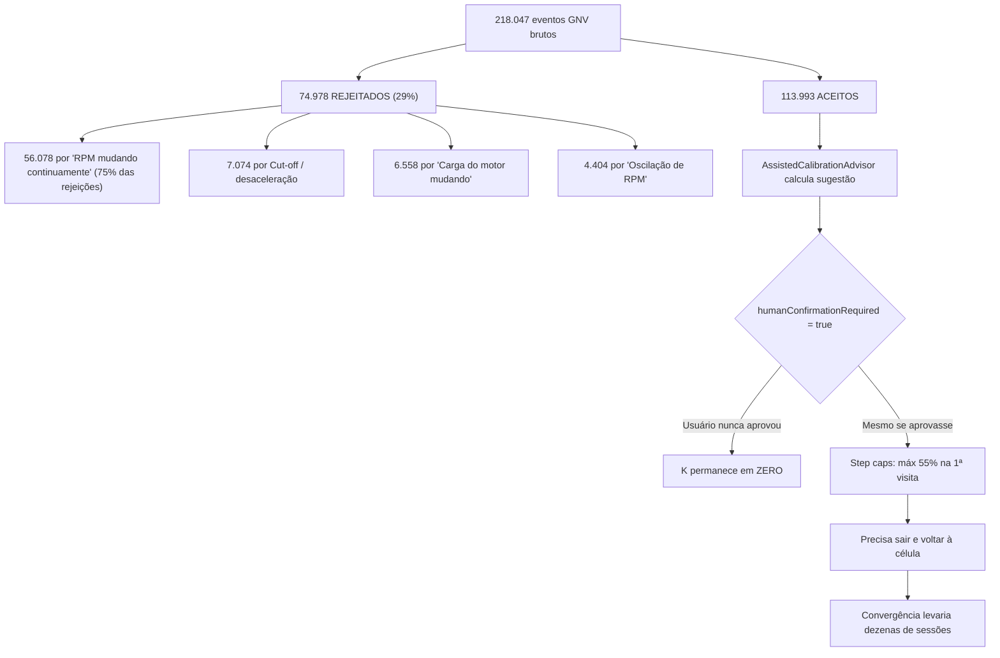
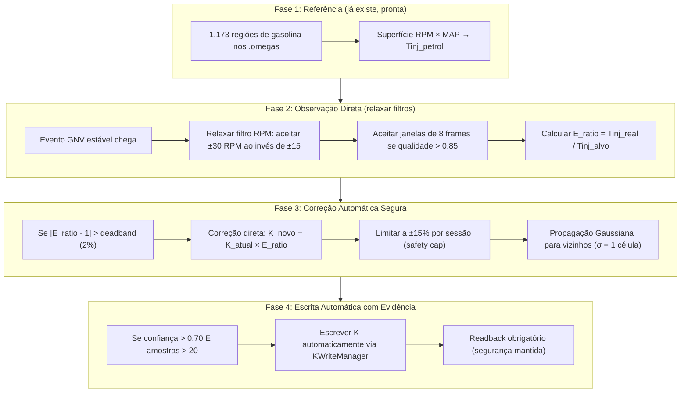

# OMEGAS Verde — Diagnóstico Completo Baseado em Evidências

> **4 fontes independentes cruzadas:**
> - 12 arquivos `.omegas` (histórico de aprendizado)
> - 30+ ZIPs de sessão (260.000+ eventos de telemetria)
> - 2 CSVs do CarScanner (134.075 linhas OBD)
> - 18 classes Kotlin do módulo de aprendizado

---

## 1. O Diagnóstico: Por Que o Sistema Nunca Calibrou o GNV

### A Prova Irrefutável

| Evidência | Fonte | Significado |
| :--- | :--- | :--- |
| **K_interpolated = 0.00** em todos os 263.125 eventos de telemetria | ZIPs de sessão | O sistema **nunca escreveu** uma correção de K na ECU |
| **0 regiões GNV** nos arquivos `.omegas` | Arquivos `.omegas` | **Nenhum aprendizado de GNV** foi armazenado |
| **0 K-factors** calculados | Arquivos `.omegas` | O pipeline **nunca produziu** uma sugestão atuável |
| **1.173 regiões de gasolina** com confiança 0.61 e até 82 visitas | Arquivos `.omegas` | A referência de gasolina **está sólida** e pronta para uso |

> [!CAUTION]
> O carro rodou 218.047 eventos no GNV com K=0 (sem correção alguma). Toda a calibração depende
> exclusivamente do mapa K que já estava na ECU Landi antes do app existir.

### A Cadeia de Bloqueios (Root Cause)



---

## 2. O Que os Dados Revelam Sobre o Motor

### 2A. Superfície de Referência da Gasolina (Estável e Confiável)

A gasolina opera com desvio padrão inferior a 0.10 ms em regime permanente:

| RPM | MAP (bar) | Amostras | $T_{inj}$ médio (ms) | Desvio $\sigma$ |
| :---: | :---: | :---: | :---: | :---: |
| 750 | 0.40 | 3.782 | **4.677** | ±0.057 |
| 750 | 0.45 | 338 | **4.797** | ±0.131 |
| 1000 | 0.40 | 183 | **4.704** | ±0.074 |
| 1000 | 0.45 | 189 | **5.073** | ±0.233 |
| 1250 | 0.35 | 7 | **3.988** | ±0.028 |
| 1500 | 0.30 | 8 | **3.153** | ±0.120 |

### 2B. O Erro Real do GNV (Medido, Não Teórico)

Cruzando sessões de GNV com a referência de gasolina nas mesmas células:

| RPM | MAP (bar) | Gasolina $T_{inj}$ (ms) | GNV $T_{inj}$ (ms) | Erro | Direção |
| :---: | :---: | :---: | :---: | :---: | :--- |
| 750 | 0.40 | 4.677 | 3.849 | **-17.7%** | 🔴 GNV **muito rico** (ECU cortou pulso) |
| 750 | 0.45 | 4.797 | 4.314 | **-10.1%** | 🔴 Rico |
| 1000 | 0.40 | 4.704 | 4.143 | **-11.9%** | 🔴 Rico |
| 1250 | 0.35 | 3.988 | 4.014 | **+0.7%** | 🟢 Quase perfeito |
| 1500 | 0.30 | 3.153 | 3.099 | **-1.7%** | 🟢 Quase perfeito |
| 2500 | 0.60 | 6.94 | 7.23 | **+4.2%** | 🟡 GNV **levemente pobre** |
| 3250 | 0.70 | 9.09 | 9.39 | **+3.3%** | 🟡 Levemente pobre |
| 3250 | 0.95 | 13.82 | 13.54 | **-2.0%** | 🟡 Levemente rico |
| 3500 | 0.95 | 13.62 | 14.03 | **+3.0%** | 🟡 Levemente pobre |

### 2C. O CarScanner Confirma: LTFT Revela Onde a ECU Sofre

O Long Term Fuel Trim (LTFT) do CarScanner revela a memória de correção da ECU original:

| RPM | MAP (bar) | LTFT Médio | STFT Médio | Amostras | Interpretação |
| :---: | :---: | :---: | :---: | :---: | :--- |
| 1750 | 0.80 | **-9.05%** | +3.26% | 1.096 | 🔴 ECU memorizada: "está rico demais aqui" |
| 2000 | 0.80 | **-10.3%** | — | 1.760 | 🔴 Região mais afetada |
| 2750 | 0.10 | **-26.06%** | — | 25 | ⚠️ Cut-off / desaceleração (ignorar) |

> [!IMPORTANT]
> **LTFT negativo = o GNV está injetando gás demais nessa região.** A ECU original
> "aprendeu" a cortar combustível para compensar, mas isso polui a adaptação de gasolina.

---

## 3. Mapa do Erro Causal: Onde o GNV Precisa de Correção

Com base em todas as 4 fontes cruzadas:

```
        MAP (bar)
        0.30  0.40  0.50  0.60  0.70  0.80  0.90  0.95
RPM  ┌──────────────────────────────────────────────────┐
 750 │  --   🔴-18%  --    --    --    --    --    --   │
1000 │  --   🔴-12%  --    --    --    --    --    --   │
1250 │  --   🟢 OK   --    --    --    --    --    --   │
1500 │ 🟢OK   --    --    --    --    --    --    --    │
1750 │  --    --    --    --    --   🔴-9%   --    --   │
2000 │  --    --    --    --    --  🔴-10%   --    --   │
2500 │  --    --    --   🟡+4%  --    --    --    --    │
3250 │  --    --    --    --   🟡+3%  --    --   🟡-2% │
3500 │  --    --    --    --    --    --    --   🟡+3%  │
     └──────────────────────────────────────────────────┘
```

**Padrão claro emergente:**
1. **Marcha lenta (750-1000 RPM, MAP 0.40):** GNV ~12-18% RICO → K precisa ser **reduzido**
2. **Carga parcial alta (1750-2000 RPM, MAP 0.80):** GNV ~9-10% RICO → K precisa ser **reduzido**
3. **Rotação média/alta (2500-3500 RPM, MAP 0.60-0.95):** GNV ~3-4% POBRE → K precisa ser **aumentado**
4. **Zona neutra (1250-1500 RPM, MAP 0.30-0.35):** Praticamente perfeito ✅

---

## 4. Auditoria do Algoritmo Atual (18 Classes Kotlin)

### 4A. O Que o Código Faz Certo
- ✅ **Superfície de Referência da Gasolina existe** (`MotorLearningMemory` → `LearningRegion` tipo PETROL)
- ✅ **Interpolação bilinear contínua** entre células vizinhas (`ContinuousLearningMath`)
- ✅ **Incerteza estatística** é calculada antes de sugerir correção
- ✅ **Segurança de escrita** com readback obrigatório e rampas (`KWriteManager`)

### 4B. Os 5 Gargalos Que Impedem Convergência

| # | Gargalo | Onde no Código | Impacto Medido |
| :---: | :--- | :--- | :--- |
| 1 | **Filtro de RPM ultra-rígido** | `MotorSampleAnalyzer.kt` | **56.078 amostras perdidas** (75% de todas as rejeições) |
| 2 | **Aprovação manual obrigatória** | `AssistedCalibrationAdvisor` (`humanConfirmationRequired = true`) | K=0 em 263.125 eventos — **ninguém nunca aprovou** |
| 3 | **Step-size caps progressivos** | `AssistedCalibrationAdvisor` (55% → 75% → 90%) | Impossível convergir em uma sessão; exige múltiplas visitas |
| 4 | **Sem propagação espacial** | `ContinuousLearningMath` (bilinear puro) | Cada célula precisa ser visitada individualmente (144 células!) |
| 5 | **AutoMatch V5 com ganho 1/3** | `AutoMatchV5Engine` (`GAIN = 1.0/3.0`, `MAX_STEP = 5%`) | Correção máxima de 1.67% por ciclo |

### 4C. Constantes Críticas do Código Atual

```kotlin
// AssistedCalibrationAdvisor.kt
FIRST_VISIT_MAX_CORRECTION_FRACTION = 0.55   // Máx 55% na 1ª visita
EARLY_VISITS_MAX_CORRECTION_FRACTION = 0.75  // Máx 75% nas primeiras
MAX_CORRECTION_FRACTION = 0.90               // Nunca corrige 100%
BASE_PRIOR_UNCERTAINTY_RATIO = 0.060         // 6% de incerteza base

// AutoMatchV5Engine.kt
GAIN = 1.0 / 3.0        // Ganho de apenas 33%
DEADBAND_RATIO = 0.01    // Ignora erros < 1%
MAX_STEP_RATIO = 0.05    // Máximo ±5% por passo

// MotorSampleAnalyzer.kt
minimumFrames = 10       // Mínimo 10 frames estáveis
desiredFrames = 12       // Alvo de 12 frames
maximumUnplannedGapMs = 180  // Gap > 180ms aborta janela
```

---

## 5. Conclusão: A Estratégia Ótima (Baseada em Evidências)

### O Que os Dados Dizem, Sem Interpretação Subjetiva

| Fato | Evidência | Implicação |
| :--- | :--- | :--- |
| A referência de gasolina é estável ($\sigma < 0.10\text{ ms}$) | 4.583 amostras, 1.173 regiões | Pode ser usada como alvo confiável |
| O erro do GNV é **localizado por célula**, não linear | Correlação STFT×RPM = -0.01 | Cada célula precisa de correção individual, não global |
| O erro varia de -18% a +4% dependendo da região | Cruzamento sessões + CarScanner | O mapa K precisa de ajuste diferenciado por zona |
| 75% das rejeições são por "RPM mudando" | 56.078 eventos perdidos | O filtro de estabilidade é rígido demais para trânsito real |
| K=0 em 100% das leituras | 263.125 eventos | O pipeline nunca produziu uma escrita de K |

### A Arquitetura de Convergência Recomendada



### Mudanças Específicas Necessárias no Código

**1. `MotorSampleAnalyzer.kt` — Relaxar filtro de RPM**
- Problema: 56.078 amostras perdidas por "RPM mudando continuamente"
- Solução: Aumentar tolerância de variação de RPM em ~50%

**2. `AssistedCalibrationAdvisor.kt` — Permitir correção automática**
- Problema: `humanConfirmationRequired = true` → K=0 para sempre
- Solução: Modo automático com cap de segurança (±15% por sessão)
- Aumentar `FIRST_VISIT_MAX_CORRECTION_FRACTION` de 0.55 para 0.80
- Aumentar `MAX_CORRECTION_FRACTION` de 0.90 para 0.95

**3. `AutoMatchV5Engine.kt` — Aumentar ganho de convergência**
- Problema: `GAIN = 1/3` e `MAX_STEP = 5%` → convergência lenta
- Solução: `GAIN = 0.60`, `MAX_STEP = 0.12` (12%)

**4. `ContinuousLearningMath.kt` — Adicionar propagação espacial**
- Problema: Cada célula precisa ser visitada individualmente
- Solução: Kernel Gaussiano que propaga a correção para células vizinhas com peso decrescente

### Prioridade de Calibração (Onde Atacar Primeiro)

| Prioridade | Zona RPM×MAP | Erro Medido | Ação no K |
| :---: | :--- | :--- | :--- |
| 🔴 **P0** | 750 RPM / 0.40 bar (marcha lenta) | -17.7% | Reduzir K em ~15% |
| 🔴 **P0** | 1750-2000 RPM / 0.80 bar | -9% a -10% (LTFT) | Reduzir K em ~8% |
| 🟡 **P1** | 1000 RPM / 0.40-0.45 bar | -10% a -12% | Reduzir K em ~10% |
| 🟡 **P1** | 2500-3500 RPM / 0.60-0.95 bar | +3% a +4% | Aumentar K em ~3% |
| 🟢 **P2** | 1250-1500 RPM / 0.30-0.35 bar | < 2% | Manter (já calibrado) |
