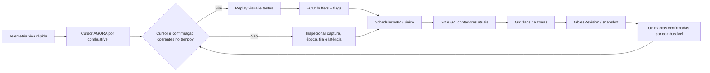

# OMEGAS · Latência e coerência das zonas AutoCal (2026-10-08)

## Contrato e fonte de verdade
Branch de integração `work/platina-final`, regras 1–17 de `AGENTS.md`. Nenhuma mudança de bytes, protocolos, nova porta serial, quantidade de leituras, comando de reset ou gravação. UI mantém gráfico e oito abas; leitura anterior NÃO aparece.

## Causa rastreada no código (classe 1)
- `TelemetryForegroundService`: `autoCalTick` a cada 100 ms; divide scheduler com telemetria.
- `NativeAutoCalRefreshPlanner`: aquisição por grupos G2/G3/G4/G6, rodada nominal a cada 2.000 ms; cada grupo exige leitura e probe da mesma época.
- `NativeAutoCalMonitor`: tabela atualizada por `mergeOperationalFields`, `tablesRevision` e publicação `Kind.TABLES` quando dado muda.
- `autocal-cockpit.js`: cursor recebe telemetria rápida; zonas usam projeção de flags/contadores da ECU. Antes o grupo **G3 histórico** vinha antes dos contadores do GNV e da leitura de zonas; em deslocamento rápido o cursor já pode estar na próxima zona quando chega a marcação da anterior.
- `renderZoneCursor` iluminava simultaneamente as linhas de gasolina e GNV embora apenas um combustível esteja ativo; transição também não deve destacar o combustível errado.

## Fato operacional vs inferência
Os atrasos são coerentes com a ordem/cadência observadas, mas a duração exata no carro depende do scheduler, transporte e resposta da ECU: **não aferida neste commit**. A aquisição da ECU tem timestamp anterior à leitura que a confirma; nunca atrelar essa confirmação à posição atual do cursor nem fabricar uma aquisição.

## Fatia implementada
1. Manter o mesmo conjunto de comandos, prioridade da rodada de aquisição passa a **G2 gasolina → G4 GNV → G6 flags das zonas → G3 dados históricos**. As flags e contadores novos chegam antes de uma leitura histórica.
2. A posição AGORA ilumina apenas o combustível ativo; gasolina no GNV, GNV na gasolina, cutoff ou transição ficam sem destaque incorreto.
3. Os estados **adquirida/falta** continuam derivados exclusivamente da ECU, não da telemetria.
4. Provas: `tests/ui/autocal-zone-sync.test.cjs`, `NativeAutoCalRefreshPlannerTest.kt`, contratos de leitura; CI é a autoridade no SHA exato.

## Teia de diagnóstico para o próximo ciclo

## Próxima etapa, sem novos cérebros
A Curva K global e o Mapa K local precisam compartilhar o mesmo cálculo do `AutoMatchRefinedEngine`, usando o mesmo sinal/percentual e os mesmos filtros de outlier, limites e histerese. Na Curva K, a correção afeta a vizinhança temporal do nó; no Mapa K, o mesmo delta relativo é projetado apenas nas células `tempo de gasolina × RPM` respaldadas por evidência local. O Mapa K é destino da sugestão, não um novo motor. A aplicação continua exclusivamente manual, com foto/readback, teste de vizinhos e rollback. O estudo offline de sensibilidade antiga `tools/map_k` não deve ser interligado à UI; após preservar seu valor de diagnóstico, decidir a poda com testes e busca de consumidores.

## Pendências de verificação
- Classe 4: comparar antes/depois em Chromium com atualização de grupos + transição de combustível + cursor que sai de Z4 para Z1.
- Classe 5: capturar timestamps reais de grupo/flag/maturidade/cursor em condução. Quantificar percentis P50/P95, não só sensação visual; nenhum SLA é afirmado sem essa prova.
- Curva local proporcional: replay com dados reais e paridade ao Refino da Platina antes de integrar sugestão na UI. Sem escrita automática.
