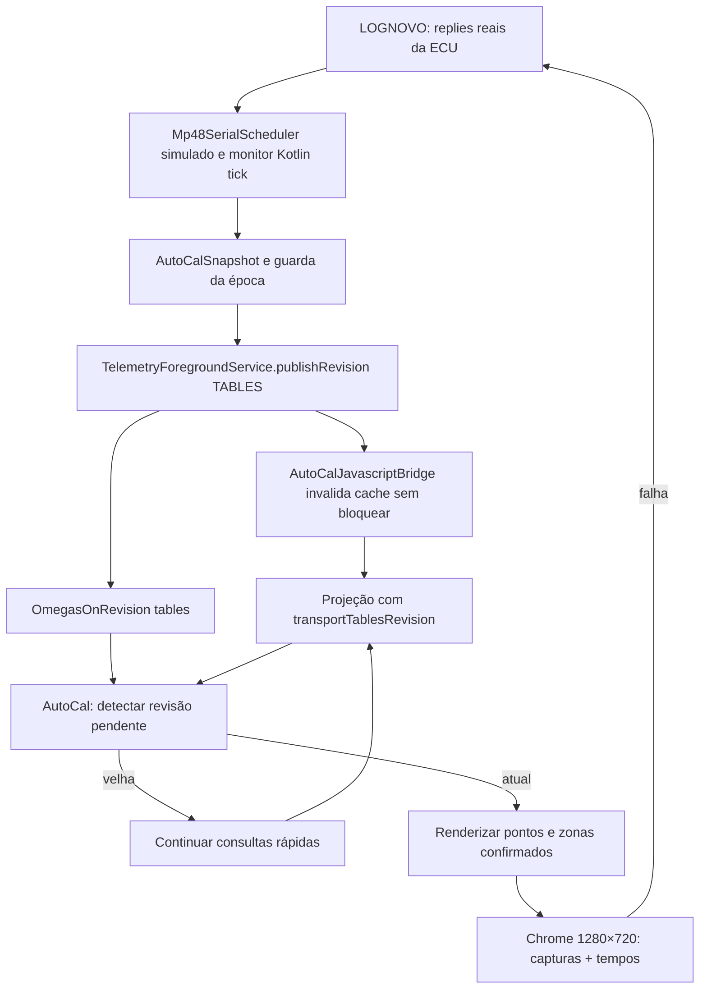

# LOGNOVO → monitor Kotlin → revisão → bridge → gráfico (OMEGASCINZA, 2026-10-09)

## Problema reproduzido

Em uma sessão real o cursor muda de MAP/RPM antes de a HMI marcar a zona recém-adquirida. A teia Chrome já tinha encontrado ~2,75 s até AutoMatch/reset aparecer, enquanto os quadros visuais eram fluidos.

O monitor faz leituras seriadas em grupos; a fonte de verdade do AutoCal é a ECU. No evento de alteração de tabelas, `TelemetryForegroundService.publishRevision(TABLES)` envia `OmegasOnRevision`, mas `AutoCalJavascriptBridge.getUiProjection()` devolvia `BackgroundMemo` ainda na revisão anterior. O controlador JavaScript marcava sua leitura como concluída, pois `projection.ok` era verdadeiro. Sem outra revisão nova, a projeção só era relida pelo watchdog de 2,5 s. **Causa da demora no trecho da ponte comprovada por teste mutante; a parte física USB continua não medida.**

## Correção mínima em produção

- `AutoCalJavascriptBridge.getUiProjection`: consulta apenas números de revisão `tables` e `session` já mantidos pelo serviço; se mudaram, invalida o memorando em background (não executa cálculo na thread WebView). Não mexe nos 1.000 ms do memo de análises pesadas, nos comandos serial, nem nos threads da engine.
- `computeUiProjection`: anexa `transportTablesRevision` e `transportSessionRevision` lidos **antes** de montar o snapshot. Se a revisão mudar durante o cálculo, o marcador antigo não passa por novo.
- `AutoCalUxModel.projectionBehindRevisions`: vê se a ponte está aquém das revisões `tables` **ou** `session` recebidas pelo front-end. Em caso afirmativo, `projectionWarming` mantém a releitura rápida até a nova projeção chegar. Trocas de USB/sessão também invalidam a projeção anterior. Para ponte antiga sem token, sem revisão inicial ou valor desconhecido, mantém comportamento anterior, evitando loop eterno.

## Cadeia e provas

- **Prova 3, Kotlin**: `LognovoNativeMonitorSerialReplayTest.kt` usa bytes originais LOGNOVO dos três AutoMatch, com campos ausentes explicitamente simulados, e passou no GitHub antes desta mudança (run 37879622331). Não tem uma WebView Android nem a ECU física.
- **Prova unitária UI**: `tests/ui/autocal-projection-freshness.test.cjs` verifica os tokens e que revisões ausentes não criam polling infinito. Rodou TDD: 4 falhas ANTES da implementação, 4 sucessos DEPOIS.
- **Prova Chromium**: `tools/ui_stress/autocal-transport-causality.cjs` renderiza **o HTML real** em 1280×720, injeta três respostas de ponte em cache antes de cada atualização e mede AutoMatch, reaprendizado GNV e limpeza completa. Na MMMACHINE houve, em um ensaio, 212/227/198 ms; em repetição, 200/251/221 ms, zero page errors. Os números medem o caminho da ponte **simulada e do Chrome**, não uma taxa física de aquisição da ECU.
- **Mutante negativo:** `OMEGAS_REVISION_MUTANT=1` desliga o reconhecimento de revisão pendente mantendo o restante igual. No Chrome o primeiro AutoMatch passou de 2,4 s e o teste **falhou por timeout**. Com a implementação ativa, a mesma prova passou.
- O `ci.yml` para branch `OMEGASCINZA` executa o teste visual de revisão em cada push e publica as capturas/JSON como artefato. Chromium ausente reprova, não pula.

## Ainda fora da prova

O teste Chromium recebe um **bridge emulado**, embora utilize o mesmo HTML/CSS/JS real. O teste JVM recebe o serial emulado com respostas LOGNOVO reais, mas não abre Chrome no mesmo processo Android. Não declarar classe 5, nem "latência física resolvida" sem o carro. As 8 abas, geometria 1280×720, a função original do AutoCal, os comandos e todos os writers da ECU foram preservados.

**Seguimento:** usar um ciclo real na ECU para correlacionar timestamps da leitura de cada contador, início/fim dos grupos, publicação da revisão e desenho da zona; comparar com as transições do simulador. Evitar alterar intervalos 2s/4s sem prova de necessidade.
