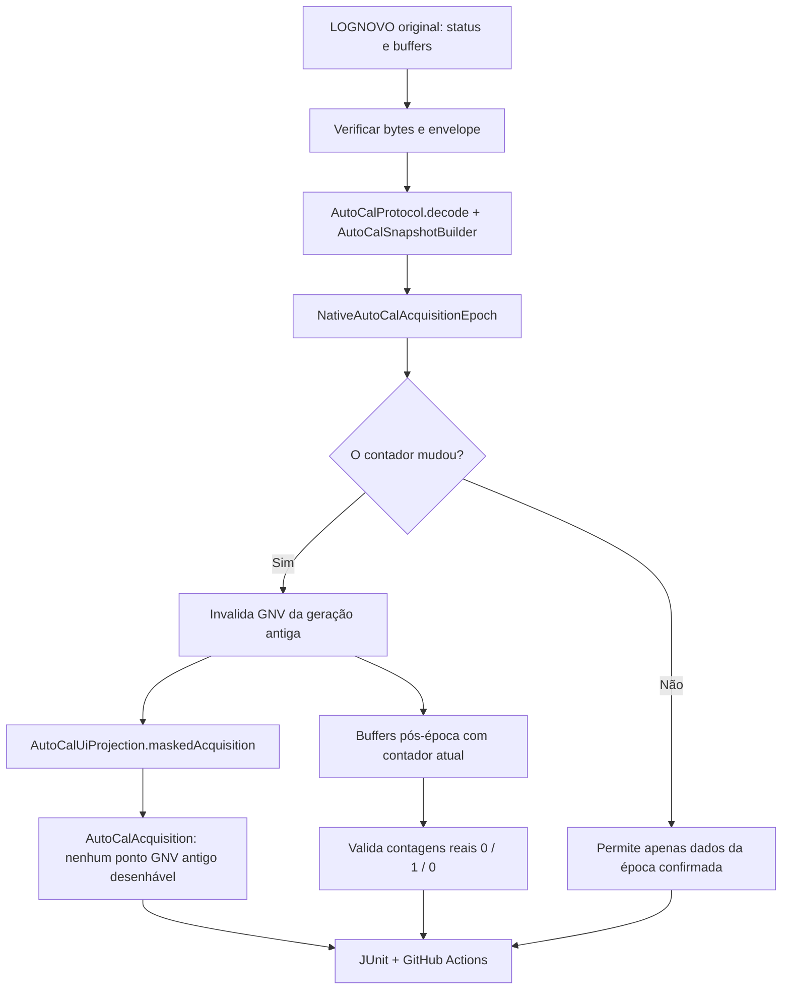

# LOGNOVO original → decodificação Kotlin, guarda de época e projeção (OMEGASCINZA)

**Objetivo único:** provar que o aplicativo reconhece as três mudanças de AutoMatch que ocorreram **na ECU**, com os bytes originais do ProgBase/LOGNOVO, e não reutiliza os pontos da geração GNV antiga.

## Fonte de autoridade

- Fixture já existente `tests/fixtures/portmon-lognovo-autocal-epochs-v1.json`, classificada `ORIGINAL_DERIVED`, provinda do LOGNOVO original verificado pelo extrator `tools/omegas/extract_lognovo_autocal_epochs.py`. É um recorte auditável, não telemetria sintética.
- O LOGNOVO bruto, o ZIP e o executável/licença original **não** entram no GitHub.
- A sequência de AutoMatch nativa tem 0→1, 1→2, 2→3. O contador GNV anterior mostrava 13/10/9 bandas positivas; no bracket após cada AutoMatch, respectivamente 0/1/0. A gasolina pós-época mostra 13/14/14. Estes brackets **não** são uma amostragem simultânea de todos os campos.
- Os bytes das requisições são verificados contra `AutoCalProtocol.read(field)` e `CMD_NATIVE_STATUS`, com validação de eco, ACK, comprimento e checksum. Nenhum frame novo é gerado nem transmitido.

## Teste implementado

`app/src/test/java/com/omegas/prohub/autocal/LognovoNativeEpochKotlinReplayTest.kt` percorre:

Verificações: três contadores originais e suas gerações, veto ao grupo GNV com contador anterior, aceitação dos grupos pós-época, dimensão 18 e escala/decoder via `AutoCalSnapshotBuilder`, comparação bloqueada até referência nova, mascaramento do GNV antigo na HMI, payload truncado identificado como INVALID. **Nenhum comando de escrita foi alterado.**

### Importante: limite da prova

Esta fatia executa **código Kotlin de produção** para decodificação, estado de época e mascaramento de UI, mas **não** executa `NativeAutoCalMonitor.tick()`, seu `Mp48SerialScheduler` real, USB, `RuntimeSnapshotBus` ou o DOM do AutoCal no mesmo ensaio. Não relatar como teste físico nem como fluxo completo Kotlin→WebView. `capturedAtMs` é artificial no teste apenas para fornecer uma ordenação de observações à API do builder. O LOGNOVO não comprova latência real entre transações nem simultaneidade dos brackets.

### Dado relevante para o atraso de confirmação

O `NativeAutoCalRefreshPlanner` agenda grupos de aquisição a cada **2.000 ms**, referências a cada **4.000 ms** e trata o contador nativo em sondas distintas. Isso **pode** explicar por que o cursor rápido já se moveu de zona quando a aquisição é publicada, mas não é causalidade provada. Instrumentar evento nativo recebido → geração invalidada → snapshot confirmado → revisão publicada → DOM, todos na mesma época, antes de ajustar tempos.

### Critério de entrada

O CI no GitHub (workflow `ci.yml`, `build_and_test`) é a autoridade final. A `OMEGASCINZA` foi acrescentada ao gatilho de push do CI para verificar diretamente cada SHA, sem PR extra. A máquina MMMACHINE não possui Android SDK configurado; essa falha ambiental local não é aprovação nem reprovação do teste Kotlin. Respeitar invariantes 1–17 do `AGENTS.md` e a proteção das oito abas.

### Próxima integração

Criar um `Mp48SerialScheduler` de bancada read-only que entregue respostas originais das mesmas épocas ao monitor `tick()`. Só depois coletar timestamps de projeção até a WebView e testar reatividade em transições rápidas, corte de injeção e regiões RPM×MAP usando a telemetria LOGNOVO. Não modificar os bytes de comando nem os writers.
