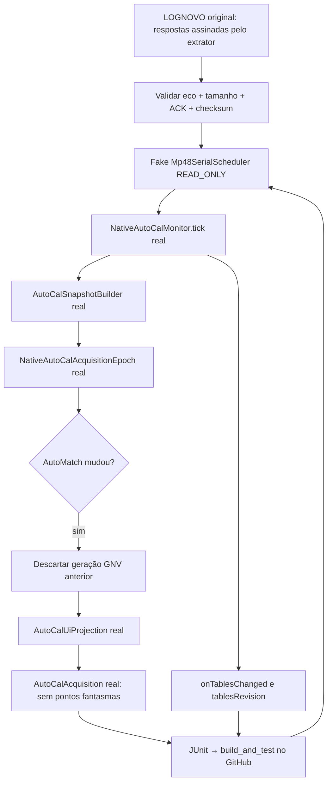

# LOGNOVO → serial falso → NativeAutoCalMonitor.tick() → projeção nativa (2026-10-09)

## Objetivo de prova

Executar **o mesmo monitor Kotlin de produção**, usando `Mp48SerialScheduler` em memória, sem USB nem comandos graváveis. Os dados disponíveis são respostas seriadas **capturadas na ECU com ProgBase** (fixture `tests/fixtures/portmon-lognovo-autocal-epochs-v1.json`).

## Teste

`app/src/test/java/com/omegas/prohub/autocal/LognovoNativeMonitorSerialReplayTest.kt`

- Etapa 0: status AutoMatch 0, vetores originais de gasolina, GNV e `MUL_ACT` antes da mudança.
- Etapas 1/2/3: leituras de status com contadores 1/2/3, buffers correspondentes depois da mudança e `MUL_ACT` real da mesma época.
- Após os três AutoMatch, os contadores de GNV por bandas positivas são respectivamente **0, 1 e 0** (antes: 13, 10 e 9).
- A resposta original só é entregue se o `request` emitido pelo próprio monitor coincidir **byte a byte** com o request registrado; eco e checksum devem ser válidos. A enumeração de comandos não foi alterada.
- Campos ausentes da fixture recebem um **erro do SIMULADOR** explícito `UNCAPTURED_TEST_ONLY`, sem payload nem quadro de ECU fabricado; o status `0xCA` somente facilita teste de snapshot parcial, NÃO representa resposta real observada desses campos.
- O árbitro recebe uma contagem SINTÉTICA de oportunidades de telemetria apenas para permitir determinismo dos ticks. O relógio de replay é sintético e **não** prova tempo da ECU.
- O teste observa revisões de tabela e usa a projeção nativa Kotlin real para verificar que nenhum ponto velho de GNV reaparece depois da confirmação da nova época.
- Se a infraestrutura declarar uma requisição com `Mp48WorkClass` diferente de `READ_ONLY`, o teste falha. Não existe writer nem transação física.

## Alteração mínima de testabilidade

A classe `NativeAutoCalMonitor` **já tinha** um parâmetro `clockMs` com `SystemClock.elapsedRealtime()` como padrão; havia chamadas internas diretas a `SystemClock.elapsedRealtime()` que ignoravam a injeção e impediam clocks previsíveis nos testes JVM. Todas elas passam a usar a mesma fonte `clockMs()`, **preservando o valor padrão no aplicativo físico e sem alterar agendamento, fórmula nem bytes da ECU**.

## O que ainda NÃO está provado

Não foi reproduzido o arquivo serial integral em linha de tempo contínua dentro do `Mp48SerialScheduler`; esta fixture possui brackets de três épocas, mas não todos os campos que o monitor lê a cada ciclo. O teste cobre respostas reais onde presentes e devolve falhas declaradas nas demais.

A atualização do DOM/WebView não está no mesmo teste JVM. Também não se pode afirmar latência real do firmware, cabo, scheduler da ECU, roteamento de callback à UI ou quantidade efetiva de quadros vivos. A hipótese de atraso deve ser separada em: captura pelo probe leve → leitura dos grupos → publicação de revisão → notificação JS → troca do DOM. Sem cronômetro físico a origem da demora não está fechada.

## Próximo gate

Aprovado somente quando `build_and_test` do SHA exato terminar VERDE no GitHub. Depois, instrumentar com marcadores no `RuntimeSnapshotBus` + `OmegasOnRevision` e ensaio Chromium em condições de stress, sem alterar intervalos da ECU por intuição. A arquitetura fica intacta: oito abas, botões de uma ação e nenhuma escrita automática extra.
