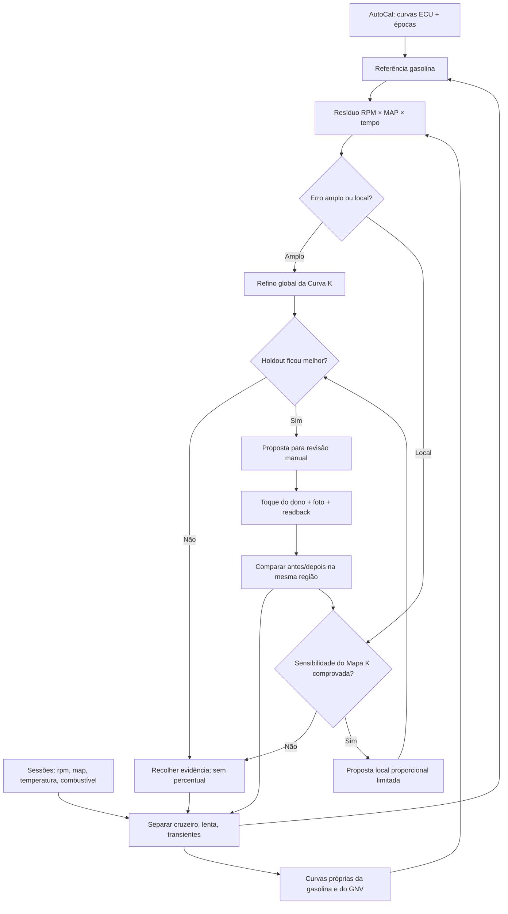

# OMEGAS · Mapa K proporcional: diagnóstico causal (2026-10-09)

**Estado: OFFLINE, SEM APK, SEM comandos ECU.** Regras: AGENTS.md 1–17; base remota work/platina-final.

## Verdades e limites

- KMapPhysicalAxes.kt: Mapa K MP48 tem 12 linhas por **tempo de gasolina** (2, 2,5, 3, 3,5, 4,5, 6, 8, 10, 12, 14, 16, 18 ms) e 12 colunas **RPM** (850 até 6500). MAP é condição de pareamento, não eixo desta tabela. Linha 0C não gravável.
- EquivalenceLedger.kt: gasolina comparada em RPM × MAP, mediana de amostras estáveis; marcha lenta (<1200 RPM) não contamina condução. Alterações de K/Mapa K invalidam a amostragem GNV antiga.
- MapKManualPlanner.kt prepara revisão somente manual. KWriteManager.kt usa readback. Não alterar writer/protocolo.
- docs/reference/progbase/FORMULAS.md confirma estrutura SC84 no ProgBase mas NÃO prova como afeta a injeção; não converter raw de Mapa K em fator físico sem medir.
- Drive: https://drive.google.com/file/d/16mu0ywMhSDNyWscXd0AvLf3V0UazHS28/view (Sessaoutil.zip). Na sessão 20h30 de 06/10 ocorreu k_batch_confirmed seq. 206: 8 células, linhas 2–5 colunas 0–1, 160→171, readbackValid e humanConfirmed. Depois ocorreram alterações da Curva K seq. 1697 e 4252 e AutoMatch.
- Antes do ajuste MAP_K não há gasolina elegível em condução; os 52 pontos GNV aceitos são de lenta. Portanto, esta intervenção NÃO identifica o ganho causal do Mapa K.

## Fluxo conectado

## Modelo matemático condicional

e = mediana robusta de ln(T_petrol_no_GNV / T_petrol_na_gasolina), em mesmo regime, RPM, MAP, temperatura comparável.
s = d ln(erro) / d ln(raw_MAP_K), desconhecido até experimento causal.
SE s medido e replicado: delta_ln_MAP_K = -alpha × e / s (alpha <= 0,5).
Teto experimental do protótipo = ±5%; não é recomendação de escrita. Sem s, ABSTER-SE.
O construtor controlled_gain() do protótipo serve exclusivamente para hipóteses sintéticas; não certifica ganho real.

## Prova antes de integrar

1. Pelo menos três intervenções independentes com gasolina e GNV antes/depois, condições equivalentes e Curva K/AutoMatch imutáveis durante a janela. Controlar pressão, temperatura, cutoff, marcha lenta e drift de sessão.
2. Identificar o sinal e incerteza de s por célula, testar sensibilidade a outliers, efeito de regiões vizinhas e falsos positivos.
3. Exigir ganho em sessões não utilizadas no ajuste (holdout), sem piorar locais antes estáveis. Não assumir que uma curva lisa significa melhor motor.
4. Só então ligar o cálculo à revisão manual existente. Nenhum botão adicional, nenhuma alteração de bytes, nenhum salvamento automático.
5. Caso não haja contrafactual: reportar SEM_CONTROLE_CAUSAL_INDEPENDENTE e parar.

**Entregas desta etapa:** tools/map_k/map_k_probe.py (só offline), tests/test_map_k_causal_gate.py (TDD) e este desenho. Fonte de verdade da integração: CI do GitHub verde no SHA. Não foi provada a redução de trancos em carro.
