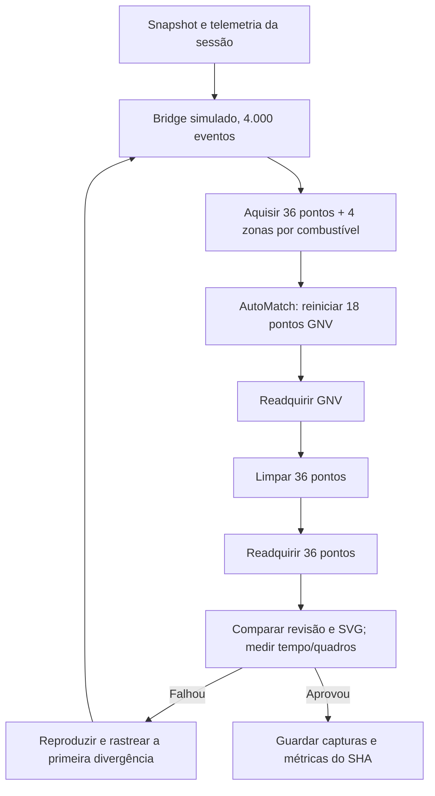

# Teia AutoCal · simulação intensa e verificável

**Escopo:** testes reais da UI HTML/JS no Chrome/Chromium usando o bridge SIMULADO de `tests/ui/helpers/teia-sim.cjs`, com telemetria derivada de sessões do repositório. Não usa hardware, não grava na ECU, não demonstra equivalência física nem mede o firmware.

## Por que existe

O CI poderia ficar verde mesmo com todos os testes `autocal-teia.test.cjs` marcados como SKIP pela ausência de Playwright. Agora o caminho **manual** de `ci.yml` instala só o módulo Node do Playwright (reaproveita o Chrome do runner) e exige que o navegador exista. Falta de navegador vira ERRO, não aprovação falsa. A simulação não roda em todo PR para preservar minutos do GitHub Actions.

## Fonte de verdade e execução

- Repositório remoto: `viluadmcontas2-dot/OMEGAS-V8.2`, branch `work/platina-final`; regras `AGENTS.md` 1–17, oito abas preservadas, bytes ECU imutáveis.
- CI já existente: GitHub → Actions → **OMEGAS PLATINA CI** → **Run workflow**, selecionar branch `work/platina-final`; execução via `workflow_dispatch`.
- `build_and_test` executa contratos e JVM antes do teste visual intensivo. O visual executa `node --test tests/ui/autocal-teia.test.cjs` **sem SKIP**, em Chromium 1280×720, e `node tools/ui_stress/autocal-browser-stress.cjs`.
- Evidências temporárias em artifacts distintos: `teia-autocal` (capturas, folha de contato e log) e `autocal-estresse-4000` (seis capturas e métricas). Não comitar PNGs ou logs de sessões privadas.

## O que é realmente testado

| Linha | Fonte de dados | Prova |
| --- | --- | --- |
| Teia de estados | Simulador nativo com os mesmos 18 buffers/combustível | Gráfico SVG, zona, combustível, contador, curva, botão e ação |
| Teia de comandos | Simulador de ações que registra chamadas | Ordem, combustível e recibos, sem executar bytes em hardware |
| Estresse | 4.000 eventos sintéticos e replay acelerado de telemetria de sessão real | Seis estados, contagem de pontos 0/18/36, revisão de projeção sincronizada, ausência de leitura anterior e erros JS |
| Desempenho | requestAnimationFrame no navegador | P95/P99 de intervalo de quadros, tempo de evento até a revisão DOM autoritativa |
| Limite | Sem ECU real, bridge Kotlin substituído | Não se afirma que falhas de USB e latência de hardware foram resolvidas |

## Sequência do estresse

O estresse tem semente pseudoaleatória determinística; contadores monotônicos durante cada época e reinicialização por evento. A UI pode descartar estados intermediários para não congelar, mas obrigatoriamente deve convergir ao estado e revisão finais em cada checkpoint. Cada checkpoint gera imagem. Não declarar `PASS` se o navegador estiver ausente.

## Resultado da rodada de investigação (máquina MMMACHINE, 2026-10-08)

- Código da interface e simulador byte a byte idênticos aos blobs do commit `33e442895c89b0b71b905a71ceb743d19d5a30a9`, confirmados por Git blob SHA antes do ensaio.
- 7/7 testes Teia no Chrome, sem SKIPs, duração total ~330s.
- Estresse inicial: 1.200 eventos, 6 checkpoints, 0 erros JS, 36/36 pontos ao final e revisão consistente.
- Estresse elevado: 4.000 eventos, 6 checkpoints, 0 erros JS, revisões confirmadas; P95 frame ~16,7 ms. Instantes evento → UI: ~1,19 s na carga; ~2,75 s ao zerar os pontos GNV após AutoMatch; ~1,27 s ao readquirir; ~2,62 s na limpeza total; ~1,18 s ao readquirir. **A sincronização de estados tem atrasos mensuráveis no simulador, apesar de a animação permanecer fluida.**
- Uma falha inicial de instrumentação procurava elementos de barra inexistente; foi corrigida para ler `data-autocal-zone-surface` e seus atributos `data-petrol-state/data-gas-state` no SVG. Não atribuir essa falha ao aplicativo.

## Próximo diagnóstico

Reproduzir o atraso medindo quatro marcos na MESMA época: (1) a ECU emitiu o evento, (2) o monitor confirmou buffers/zonas, (3) a revisão foi publicada no bridge, (4) o SVG foi atualizado. Sem estes timestamps, não atribuir os ~2,75 s exclusivamente à fila serial. Depois separar experimentos de coalescência (válida) de leitura atrasada (defeito). Repetir no carro com telemetria real como prova física, preservando os comandos do protocolo.

A integração do **mesmo motor proporcional** da Curva K no Mapa K local não é comprovada por esta teia visual. Exige replay próprio com defeitos em RPM/MAP e avaliação de vizinhos sem escrita automática.
