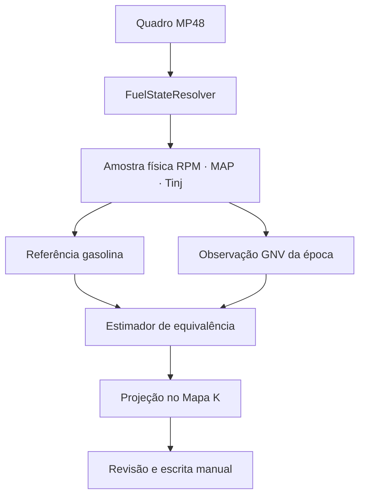

# OMEGAS VERDE — desenho arquitetural

**Data:** 2026-09-13  
**Epic:** [#37](https://github.com/viluadmcontas2-dot/OMEGAS-V8.2/issues/37)  
**Branch:** `OmegasVerde`  
**Base conhecida-boa:** `eb9791b9341aac85dfe19fccc50e42957ee4b16f`  
**Tree conhecida-boa:** `0b829496b9fb2e8f20424287d0a6c2caba4263c3`

## 1. Decisão

O OmegasVerde é uma evolução pequena e controlada do OMEGAS 8.0 RED. Ele mantém a telemetria MP48, persistência, Predictor consultivo e fluxo manual de escrita do Mapa K. A mudança central é transformar os fatos já coletados em duas superfícies simples de RPM × MAP, usando o tempo de injeção comandado pela ECU de gasolina como variável observada.

Não existe importação do Blue Causal Engine, motor paralelo, ML opaco nem escrita automática na ECU. A única exceção aprovada é o transplante isolado da apresentação visual da tela **Agora** da branch Blue mais recente; dados e comportamento continuam sob contratos Red/Verde.

## 2. Evidência utilizada

A análise foi feita diretamente sobre os fatos das sessões, sem aceitar as conclusões do algoritmo que as produziu.

| Fonte | Regiões úteis | Resultado |
|---|---:|---|
| 2026-09-10 07:13 | 152 gasolina + 183 GNV | Repetição local da gasolina: mediana 0,051 ms; 81,3% até 0,12 ms; 96,7% até 0,25 ms |
| 2026-09-06 13:36 | 324 gasolina + 187 GNV | Sessão mais dispersa, mas mantém a curva física |
| Ambas | 846 | Correlação MAP–Tinj por faixa de RPM: gasolina 0,93–0,996; GNV 0,90–0,996 |
| Validação cruzada | — | RPM+MAP: MAE 0,195 ms; +água 0,206; +temp. gás 0,223; +pressão 0,410 |
| Equivalência | — | Mediana GNV versus gasolina: +7,50% (10/09) e +10,56% (06/09) |

O CSV de 07/09 não contém tempo de injeção e não entra na análise MAP–Tinj.

Consequência: RPM, MAP e Tinj formam o núcleo. Água, temperatura, pressão e Levels são preservados para diagnóstico, mas não são dimensões nem gates de aprendizado.

## 3. Estado atual que será corrigido

### 3.1 Combustível

`Mp48Protocol.decodeStrict` reconhece apenas:

- `0x80 => GASOLINA`;
- `0x88 => TRANSICAO`;
- `0x90 => GNV`.

Qualquer outro byte vira `Mp48Fuel.UNKNOWN` e `DESCONHECIDO`, mesmo quando `gas_raw`, RPM, Tinj e o estado confirmado anterior já fornecem evidência. `MotorSampleAnalyzer` então bloqueia a amostra como `FUEL_UNKNOWN`. A interface reproduz o rótulo.

### 3.2 Levels

`level_raw` já é extraído do byte 13. `Mp48TelemetryScale.levelPercentage` usa `(255-raw)/255`, coerente com o sensor invertido. Porém `ConsumptionTracker` chama o valor de pressão, inverte novamente e pode interpretar o sentido de abastecimento de forma errada. Também calcula m³ com confiança excessiva antes de uma calibração suficiente.

### 3.3 Aprendizado

O Red possui dados físicos valiosos, mas a aceitação e a publicação passam por tolerâncias editáveis, dimensões auxiliares, reconciliações e múltiplas camadas de advisor. O Verde reduz a autoridade a um caminho central e mantém informações auxiliares apenas como observabilidade.

## 4. Arquitetura

Há uma única autoridade para cada etapa:

| Responsabilidade | Autoridade |
|---|---|
| Decodificação de bytes e escalas | `Mp48Protocol` / `Mp48TelemetryScale` |
| Estado operacional de combustível | `FuelStateResolver` |
| Validade física mínima | `PhysicalSampleValidator` |
| Referência original | `GasolineReferenceSurface` |
| Comportamento após K atual | `GnvObservationSurface` |
| Comparação e confiança | `FuelEquivalenceEstimator` |
| Projeção consultiva | `PredictorSurface` |
| Escrita | fluxo manual existente, com ACK e readback |
| Nível relativo | `LevelsTracker` |

Nomes podem ser ajustados ao padrão Kotlin existente no plano de implementação, mas não haverá autoridades duplicadas.

## 5. Resolução de combustível

O estado público deixa de ter `DESCONHECIDO`. O byte não catalogado continua registrado como diagnóstico.

| Condição | Estado público | Pode aprender? |
|---|---|---|
| Telemetria ausente/expirada | `SEM_TELEMETRIA` | não |
| RPM zero | `DESLIGADO` | não |
| Cutoff físico | `CUTOFF` | não |
| Byte 0x88 ou sinais contraditórios na troca | `TRANSICAO` | não |
| Byte 0x90 | `GNV` | sim, após confirmação |
| Byte 0x80 | `GASOLINA` | sim, após confirmação |
| Byte não catalogado + pulso GNV válido | `GNV` | sim, após confirmação |
| Byte não catalogado + motor e Tinj válidos + ausência persistente de pulso GNV | `GASOLINA` | sim, após confirmação |

Regras temporais:

1. Um quadro contraditório não comuta o estado.
2. Uma mudança usa histerese curta por quantidade de quadros e tempo máximo; não há espera fixa longa.
3. Uma perda momentânea pode publicar o último combustível confirmado com `source=LAST_CONFIRMED`, idade e confiança reduzida.
4. Ao vencer a janela de frescor, publica `SEM_TELEMETRIA`.
5. Levels, pressão e temperatura não classificam combustível isoladamente.
6. O JSON informa `state`, `source`, `confidence`, `age_ms`, `fuel_byte`, `gas_raw` e motivo.

Isso atende ao requisito de não mostrar “combustível desconhecido” sem mascarar ausência real de telemetria ou transição.

## 6. Fatos, não decisões herdadas

Cada amostra aceita preserva:

- timestamp monotônico;
- combustível resolvido e fonte;
- RPM;
- MAP em bar;
- Tinj da gasolina em ms;
- época de calibração;
- peso de qualidade;
- identificador de sessão/visita;
- sinais auxiliares como diagnóstico.

O importador Verde usa regiões/amostras físicas dos `.omegas`, mas recalcula superfícies, comparações, confiança e sugestões. Advisor, tolerâncias, comparações prontas ou conclusões de versões anteriores não são autoridades.

A migração é idempotente e preserva arquivo original, contagens de aceitação/rejeição, motivos e proveniência.

## 7. Superfícies RPM × MAP

### 7.1 Referência de gasolina

[
hat t_p(r,m) = operatorname{RobustLocalEstimate}
  {t_i, d((r_i,m_i),(r,m)), q_i}
]

onde (r) é RPM, (m) é MAP, (t_i) é Tinj e (q_i) é qualidade física.

- Toda amostra válida de gasolina participa.
- Não há raio editável que descarte vizinhos.
- A largura local é adaptativa pela distribuição real dos vizinhos.
- Distância afeta peso e incerteza.
- Estimativa robusta limita a influência de outlier sem apagar o fato.
- Contagem, dispersão, cobertura e visitas independentes acompanham o valor.
- A referência persiste entre sessões e épocas do Mapa K.

A escala da distância normalizada serve apenas para comparar e interpolar; não é tolerância de aceitação.

### 7.2 Observação no GNV

[
hat t_g(r,m,e) = operatorname{RobustLocalEstimate}
  {t_i mid combustível=GNV, época=e}
]

- O Tinj observado continua sendo o comando da ECU de gasolina durante operação no GNV.
- A superfície é separada por época (e).
- Uma alteração confirmada do Mapa K abre nova época GNV.
- A superfície de gasolina não é apagada.

### 7.3 Política de amostra

Entram amostras com RPM, MAP e Tinj finitos e dentro de limites físicos do protocolo. Amostras dinâmicas entram com peso menor calculado pela dispersão/derivada observada. Não entram motor desligado, cutoff, transição de combustível e leitura impossível.

Água, pressão e temperatura não rejeitam a amostra central. Seus problemas são registrados para diagnóstico.

## 8. Equivalência e Predictor

Para o mesmo RPM e MAP:

[
e(r,m,e)=rac{hat t_g(r,m,e)-hat t_p(r,m)}{hat t_p(r,m)}
]

Interpretação:

- (e>0): a ECU de gasolina está pedindo mais tempo durante GNV; tendência de mistura pobre; direção consultiva é aumentar GNV.
- (e<0): tendência de mistura rica; direção consultiva é diminuir GNV.
- Próximo de zero: equivalente dentro da incerteza estimada.

Não existe deadband editável. A classificação usa o intervalo de incerteza: só afirma direção quando o intervalo não cruza zero; caso contrário mostra “ainda inconclusivo”. Isso substitui tolerância arbitrária por evidência.

A confiança combina:

- quantidade efetiva;
- visitas independentes;
- dispersão local;
- distância ao suporte;
- concordância direcional;
- frescor da época GNV.

Uma estimativa pode existir com confiança baixa; falta absoluta de referência retorna “ainda sem base”, nunca zero inventado.

### Projeção no Mapa K

O espaço físico do Mapa K continua `RPM × Petrol Inj.`. A projeção ocorre somente depois da comparação:

1. consulta a referência por RPM × MAP;
2. calcula erro e intervalo;
3. usa RPM e Tinj observado no GNV para localizar pesos bilineares nas células físicas;
4. agrega apenas evidência da época ativa;
5. converte o erro em proposta percentual pelo `MapKManualPlanner` já verificado;
6. limita passo e faixa física;
7. apresenta antes/depois para revisão.

Previsões nunca retroalimentam suporte, contagem ou confiança.

## 9. Levels e consumo

Definições sem ambiguidade:

[
empty_index = level_raw/255
]

[
remaining_index = 1-empty_index
]

- `level_raw=0`: extremo mais cheio do ADC.
- `level_raw=255`: extremo mais vazio do ADC.
- O índice é relativo e não representa m³ por si só.

`LevelsTracker` mantém valor bruto, centro filtrado robusto, tendência, estabilidade e eventos. Uma queda material e persistente de `level_raw` após estabilização indica abastecimento provável. Pico isolado não cria evento.

Volume em m³ só aparece depois de calibração explícita com abastecimento real e capacidade. A UI informa “nível relativo” antes disso. O estimador calibrado inclui limite de capacidade e incerteza; não extrapola além da faixa observada.

Levels não participa do aprendizado MAP–Tinj nem determina o combustível ativo.

## 10. Interface enxuta

As mudanças visuais ficam restritas à tela Agora e aos cards de Predictor/Learning descritos abaixo.

### 10.1 Tela Agora — apresentação visual Blue isolada

Decisão aprovada em 2026-09-13: usar a organização visual da tela Agora existente na branch `work/omegas-blue-causal-engine`, sem importar qualquer lógica Blue.

Fonte congelada:

- head inspecionado: `08c6dc79c829851c7ee52cfdf8bea280de75df59`;
- dashboard: `app/src/main/assets/ui/screens/dashboard.js`, blob `fa36673d948f73133afd7a112ccd897803a885c6`;
- folha de origem: `app/src/main/assets/ui/styles-witness-multimedia.css`, blob `f2245e80a1b9a7dad0ffee199c4d3c64ba141e10`;
- introdução visual: commit `313dbd4599f69a87719774d0fc24ecf23f7ad4bd`;
- compatibilidade WebView refletida no blob atual: commit `4aa2d1b0ab1feb88e4cc3f3eedfb20376694961c`.

A tela Verde preserva a mesma hierarquia:

1. título **Agora — O que o motor está fazendo**;
2. Petrol Injection como única leitura principal;
3. cards RPM, MAP, combustível, STFT e célula;
4. faixa de saúde com sessão, ECU, OBD opcional e idade da telemetria;
5. estados desconectado, normal, atrasado, expirado e travado;
6. layout responsivo para multimídia 1280×720.

STFT e OBD permanecem estritamente informativos e opcionais nessa tela. Eles não entram no aprendizado Verde e a ausência deles não bloqueia RPM, MAP, Tinj, combustível ou sessão MP48.

Isolamento obrigatório:

- copiar a estrutura do dashboard atual, adaptada aos contratos de Store Red/Verde;
- extrair somente os seletores `now-*` e os ajustes de rota do dashboard para `styles-dashboard-now.css`;
- não copiar a folha Blue inteira, pois contém regras para OBD, Mapa K e Curva K;
- não copiar arquivos Kotlin `blue/`, engines, modelos, policies, estados causais, advisor ou persistência;
- não alterar o writer, Mapa K, Curva K ou telas fora do recorte;
- manter sintaxe compatível com WebView legado;
- não renderizar combustível desconhecido como gasolina/GNV por palpite visual; o dashboard consome o resolvedor de #40 quando disponível.

### 10.2 Predictor e Learning

Card principal, sempre na mesma ordem:

1. **Agora:** GNV, Gasolina, Transição ou Sem telemetria.
2. **Condição:** `2.100 rpm · MAP 0,56 bar`.
3. **Gasolina esperada:** `4,70 ms`.
4. **No GNV agora:** `5,05 ms`.
5. **Diferença:** `+7,4% · precisa mais GNV`.
6. **Confiança:** `Média · 18 observações / 3 visitas`.
7. **Revisar no Mapa K**, quando houver proposta.

Princípios:

- uma ideia por linha;
- rótulo antes do valor;
- unidade junto ao número;
- estado escrito, nunca somente cor;
- detalhes técnicos recolhidos;
- tracing visual desligado por padrão;
- foco e leitura de tela previsíveis.

A tela de tolerâncias deixa de expor controles científicos editáveis. Mostra apenas: “A confiança é ajustada automaticamente pela proximidade, repetição e dispersão”. Operações destrutivas ou de importação continuam explícitas e confirmadas.

## 11. Segurança da ECU

Invariantes não negociáveis:

- Predictor é somente leitura/decisão.
- Nenhum caminho de aprendizado chama escrita.
- Usuário abre revisão no Mapa K.
- Preview mostra célula, K atual, K proposto, delta e limites.
- Confirmação humana inicia o lote.
- Cada célula exige ACK.
- Readback verifica o valor.
- Falha parcial interrompe a sequência e lista confirmadas/não confirmadas.
- Mudança confirmada abre nova época GNV.

## 12. Compatibilidade e falhas

- Arquivo legado inválido não altera armazenamento ativo.
- Migração ocorre em cópia e só troca a versão ativa após validação.
- Falha de superfície não derruba telemetria.
- Ausência de gasolina suficiente é comunicada como falta de base.
- Sinal de combustível contraditório entra em transição.
- Telemetria expirada é “Sem telemetria”.
- Reinício não inventa abastecimento.
- Preferências antigas de tolerância podem ser lidas para migração, mas deixam de comandar o núcleo.
- O rollback funcional é retornar ao SHA-base e ao arquivo original preservado.

## 13. Verificação e GitHub Actions

| Mudança | Gate mínimo |
|---|---|
| Somente documentação | contratos documentais; sem build Android |
| JS/UI | testes DOM/Node + contratos |
| Kotlin puro | unit tests direcionados + contratos |
| Android/Gradle/recursos | unit tests + lint + assembleDebug |
| Candidato de entrega | suíte integral + replays + verificação manual da ECU |

O workflow da branch terá filtros de caminho, cache e `concurrency` com cancelamento de execução obsoleta. Não será criado um workflow concorrente para a mesma autoridade. APK não será gerado a cada commit.

Matriz obrigatória:

- bytes conhecidos e não catalogados;
- gasolina, GNV, transição, cutoff, motor desligado e telemetria expirada;
- ruído de um quadro;
- inversão e tendência de Levels;
- abastecimento provável;
- importação das duas sessões;
- reconstrução independente de conclusões antigas;
- estabilidade da referência;
- interpolação, incerteza e outlier;
- abertura de nova época;
- card nos quatro estados;
- ausência de escrita automática;
- ACK/readback no simulador/replay.

## 14. Sequência rastreável

1. [#41 VERDE-01](https://github.com/viluadmcontas2-dot/OMEGAS-V8.2/issues/41) — base e contrato.
2. [#45 VERDE-08](https://github.com/viluadmcontas2-dot/OMEGAS-V8.2/issues/45) — transplante visual isolado da tela Agora.
3. [#40 VERDE-02](https://github.com/viluadmcontas2-dot/OMEGAS-V8.2/issues/40) — combustível.
4. [#39 VERDE-03](https://github.com/viluadmcontas2-dot/OMEGAS-V8.2/issues/39) — superfícies e equivalência.
5. [#38 VERDE-04](https://github.com/viluadmcontas2-dot/OMEGAS-V8.2/issues/38) — migração.
6. [#42 VERDE-05](https://github.com/viluadmcontas2-dot/OMEGAS-V8.2/issues/42) — Levels.
7. [#43 VERDE-06](https://github.com/viluadmcontas2-dot/OMEGAS-V8.2/issues/43) — UI.
8. [#44 VERDE-07](https://github.com/viluadmcontas2-dot/OMEGAS-V8.2/issues/44) — CI e integração.

A tela Agora pode ser transplantada isoladamente após seu plano específico. Combustível e Levels também podem ser implementados isoladamente após os respectivos planos. A UI depende dos contratos de combustível, superfícies e Levels. A integração final depende de todas as issues funcionais.

## 15. Critério de saída

O desenho está aceito quando o proprietário confirma que a direção preserva o Red, resolve combustível e Levels sem palpite, usa somente RPM/MAP/Tinj no núcleo, simplifica a UI e mantém a ECU sob controle manual. Só depois será escrito o plano de implementação com tarefas pequenas, arquivos exatos, testes primeiro e commits vinculados às issues.
